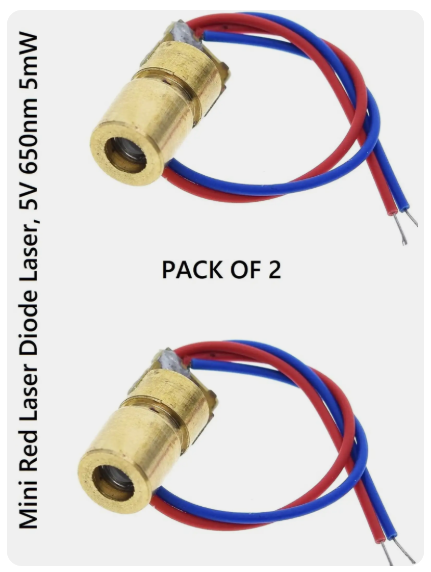
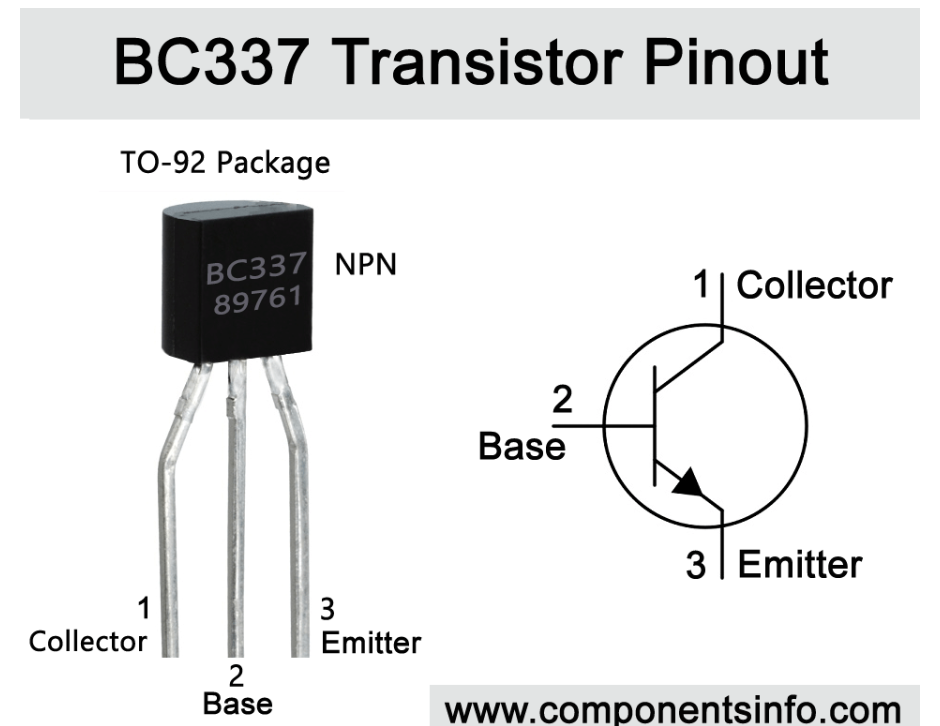
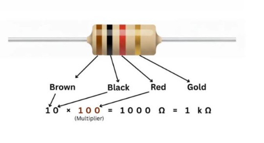
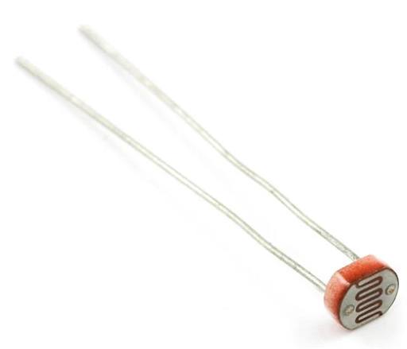
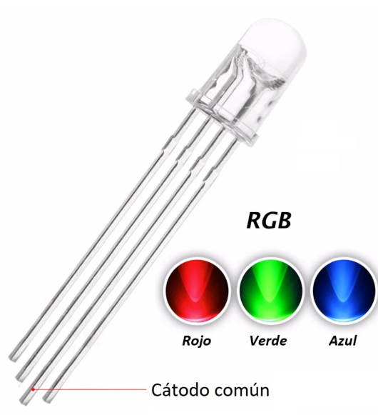
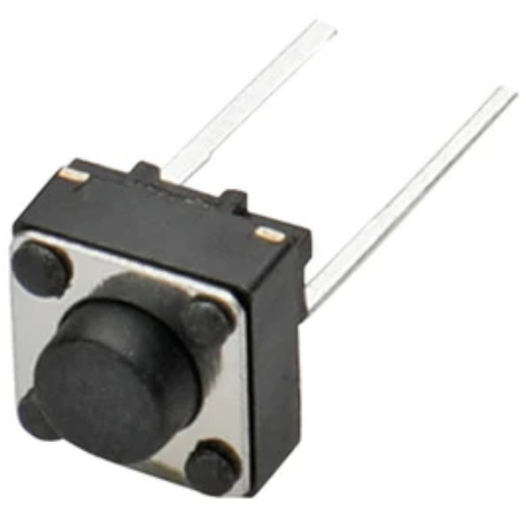
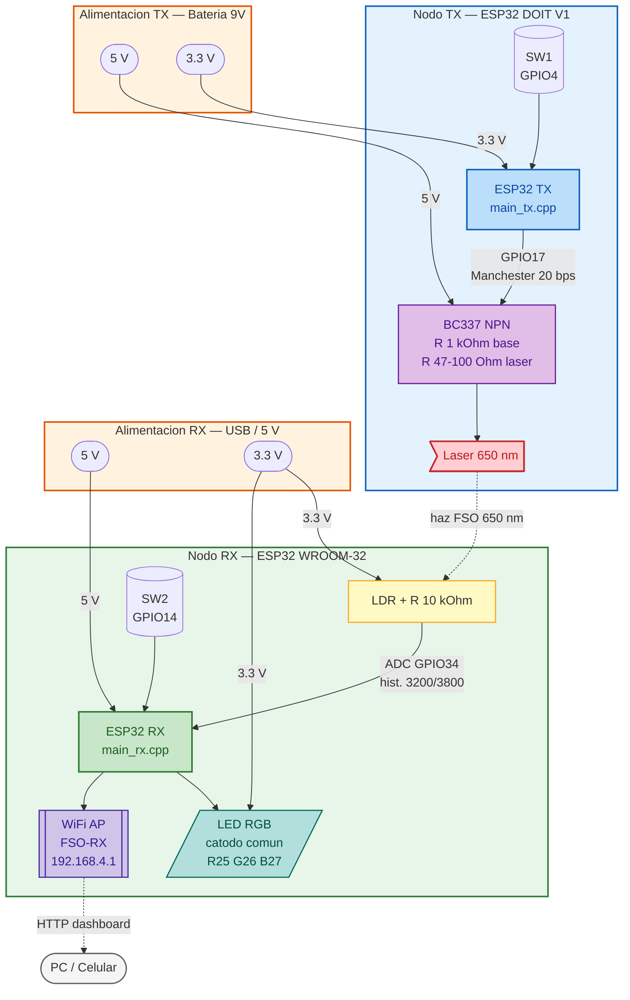
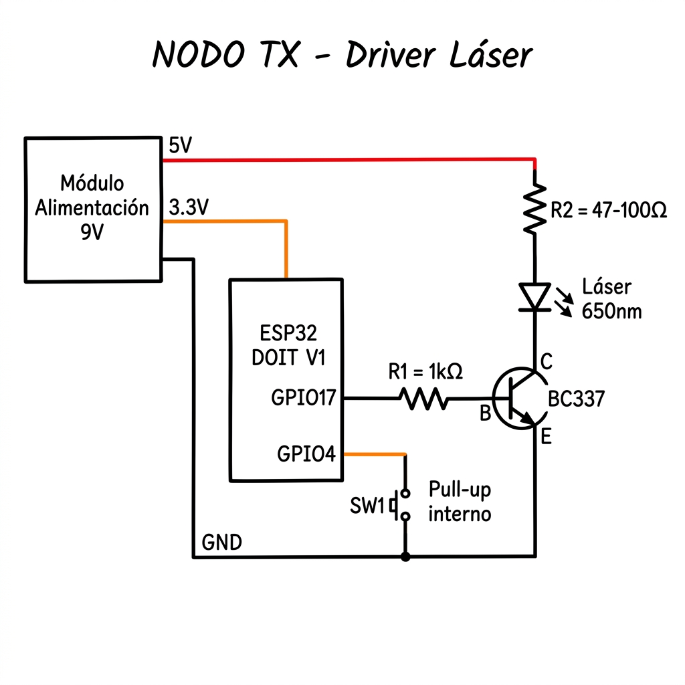
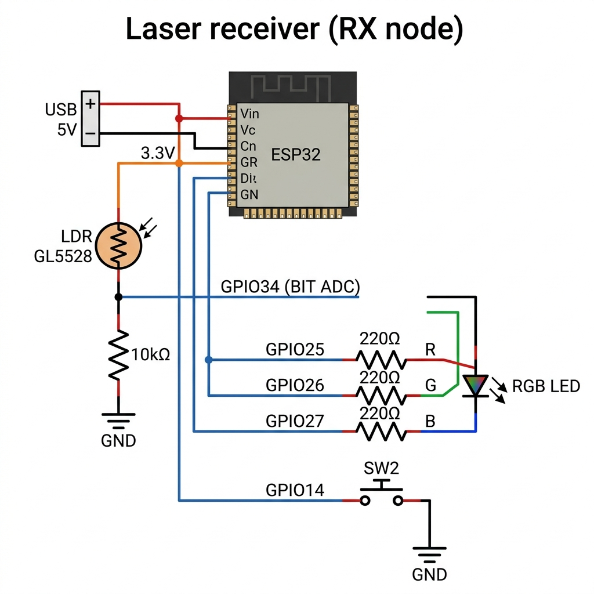
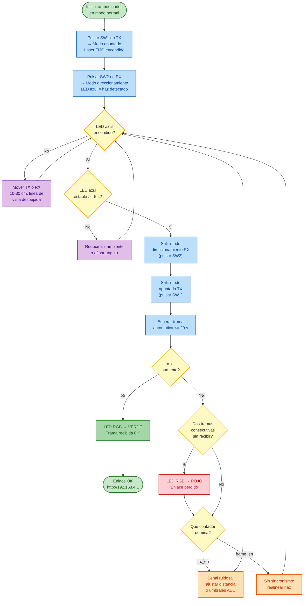

# Documento tecnico - Comunicacion laser FSO con ESP32

> Documento vigente. Refleja el firmware real en `src/main_tx.cpp` y
> `src/main_rx.cpp`. Cualquier discrepancia entre este documento y el codigo se
> resuelve a favor del codigo.

## 1. Proposito del documento

Este documento deja trazabilidad tecnica del desarrollo realizado para la practica
de Optoelectronica. El objetivo fue construir y validar un enlace de comunicacion
por laser entre dos ESP32, usando un nodo transmisor (`TX`) y un nodo receptor
(`RX`).

El trabajo no empezo directamente con la solucion actual. Se avanzo por etapas:
primero se probo una comunicacion mas tradicional por UART con tramas JSON, luego
se identificaron sus limitaciones para el enlace optico, y finalmente se migro a
una transmision binaria con codificacion Manchester, estructura C empaquetada y
CRC32.

La idea conservadora fue avanzar de lo conocido a lo especifico:

1. Validar que los datos se pudieran generar y parsear.
2. Validar una trama con control de errores.
3. Probar el enlace fisico.
4. Corregir el protocolo cuando el medio optico mostro sus limitaciones.
5. Documentar el contrato final para que TX y RX no queden desalineados.

## 2. Lista de materiales (BOM)

| Cant. | Componente | Valor / modelo | Nodo | Vista del Componente |
|------:|------------|----------------|------|:---:|
| 2 | ESP32 DevKit | 1x DOIT DevKit V1 (TX), 1x WROOM-32 30p (RX) | ambos |  |
| 1 | Modulo laser | 650 nm, <5 mW, <40 mA | TX |  |
| 1 | Transistor BC337 NPN | Ic <= 800 mA | TX |  |
| 1 | Resistencia 1 kOhm | 1/4 W, base del BC337 | TX |  |
| 1 | Resistencia 47-100 Ohm | 1/4 W, limitadora del laser | TX |  |
| 1 | Modulo alimentacion | bateria 9V -> 5V y 3.3V (tipo Arduino) | TX | - |
| 1 | LDR | GL5528 o equivalente | RX |  |
| 1 | Resistencia 10 kOhm | 1/4 W, divisor del LDR | RX |  |
| 1 | LED RGB | 5 mm, catodo comun | RX |  |

### 2.1 Principios físicos y desafíos optoelectrónicos

- **Diodo Láser (Emisor):** Su funcionamiento se basa en la *emisión estimulada* y la inversión de población dentro de una cavidad Fabry-Perot. Genera un haz con alta coherencia espacial y temporal, monocromatismo y baja divergencia, lo que permite concentrar eficazmente la energía óptica sobre el receptor a distancia.
- **LDR (Receptor):** Es un detector cuántico basado en el *efecto fotoeléctrico interno* (típicamente Sulfuro de Cadmio, CdS). Al recibir fotones con suficiente energía, los electrones saltan a la banda de conducción, disminuyendo drásticamente la resistencia del material.
- **El problema de la "inercia lumínica":** El LDR presenta una respuesta inherentemente lenta y asimétrica. Su tiempo de caída (vuelta a la oscuridad) es significativamente mayor que su tiempo de subida. Esta inercia deforma los pulsos ópticos rápidos, impidiendo el uso de pines digitales con interrupciones estándar, y obligando a digitalizar la señal por software (ADC) con técnicas de histéresis.
| 3 | Resistencia 220 Ohm | 1/4 W, serie R / G / B | RX |  |
| 2 | Pulsador 2 pines | tactil 6x6 mm | TX y RX |  |

> Los pulsadores usan `INPUT_PULLUP` del ESP32: un terminal a la GPIO, el otro a GND.
> No requieren resistencia externa.
>
> TX y RX no comparten GND: el acoplamiento entre nodos es unicamente el haz optico.

## 3. Diagrama de bloques del sistema




## 4. Esquematico electrico

### 4.0 Referencia de Pinout (ESP32)

Para facilitar la conexión física de las GPIOs y la alimentación en los prototipos, a continuación se incluye la referencia de distribución de pines (pinout) del ESP32 DevKit:


---

### 4.1 Nodo TX — driver de laser y boton



Tabla de pines TX:

| Senal | GPIO | Direccion | Conexion |
|-------|-----:|-----------|----------|
| Modulacion laser (Manchester) | 17 | OUT | R 1kΩ → base BC337 |
| Pulsador modo apuntado | 4 | IN PULLUP | SW1 a GND |
| Alimentacion logica | 3.3V | — | Modulo alim. 9V |
| Alimentacion laser | 5V | — | Modulo alim. 9V via R limitadora |
| GND | GND | — | Comun: BC337 emisor, laser catodo, SW1, modulo |

> Si el modulo laser ya incluye resistencia limitadora interna, verificar antes de
> agregar R externa para no reducir la corriente por debajo del minimo de emision.

### 4.2 Nodo RX — LDR, LED RGB y boton



> Con haz incidiendo: `R_LDR` baja → `V_ADC` sube → supera `THRESHOLD_HIGH` (3800)
> Sin haz: `R_LDR` alta → `V_ADC` baja → cae bajo `THRESHOLD_LOW` (3200)

Tabla de pines RX:

| Senal | GPIO | Direccion | Conexion |
|-------|-----:|-----------|----------|
| LDR (entrada analogica) | 34 | ADC IN | divisor LDR / R 10kΩ a GND |
| LED rojo | 25 | OUT | R 220Ω → anodo R |
| LED verde | 26 | OUT | R 220Ω → anodo G |
| LED azul | 27 | OUT | R 220Ω → anodo B |
| Pulsador direccionamiento | 14 | IN PULLUP | SW2 a GND |
| Alimentacion logica | 5V | — | USB / fuente externa |
| Alimentacion LDR y RGB | 3.3V | — | Salida 3.3V del ESP32 |

### 4.3 Aislamiento entre nodos

TX y RX tienen alimentaciones completamente separadas. No se conectan masas entre
ellos. El unico camino de informacion es el haz de luz del laser sobre el LDR.

## 5. Capa fisica del enlace

| Parametro | Valor |
|-----------|-------|
| Codificacion | Manchester (bit 1 = HIGH→LOW, bit 0 = LOW→HIGH) |
| Medio bit | 25 ms |
| Bit completo | 50 ms |
| Velocidad efectiva | 20 bps |
| Periodo de envio automatico | 20 s |
| Preambulo | 4 bytes `0x55` |
| Sync | 1 byte `0x7E` |
| Longitud | 2 bytes big-endian |
| Payload | 34 bytes `TelemetryData` |
| CRC32 | 4 bytes |
| Total por trama | 45 bytes en el protocolo, 38 en el campo LEN |

Detalles formales: ver [CONTRATO_TRAMA.md](CONTRATO_TRAMA.md).

## 6. Estructura de telemetria `TelemetryData`

```cpp
#pragma pack(push, 1)
struct TelemetryData {
  uint32_t seq;     // secuencia incremental desde boot TX
  uint32_t ts;      // segundos desde boot TX
  uint16_t F0;      // LDR simulado FOTO0 (0..4095)
  uint16_t F1;      // LDR simulado FOTO1
  uint16_t F2;      // LDR simulado FOTO2
  uint16_t F3;      // LDR simulado FOTO3
  int16_t  errAz;   // (F1+F3-F0-F2)/2  error de azimut
  int16_t  errEl;   // (F2+F3-F0-F1)/2  error de elevacion
  uint8_t  motAz;   // 1 si |errAz| > 80
  uint8_t  motEl;   // 1 si |errEl| > 80
  float    vdc;     // tension simulada (V)
  float    idc;     // corriente simulada (A)
  float    pw;      // potencia simulada (W)
};
#pragma pack(pop)
```

`#pragma pack(push, 1)` elimina padding entre campos: garantiza que TX y RX lean
exactamente los mismos 34 bytes en el mismo orden.

CRC32 IEEE (`0xEDB88320`, init `0xFFFFFFFF`, XOR final), calculado **solo** sobre
los 34 bytes de `TelemetryData`, no sobre preambulo ni campo LEN.

## 7. Modos de operacion

### 7.1 Modo normal (default)

- **TX**: timer hardware dispara una trama cada 20 s. Se puede forzar un envio
  inmediato enviando cualquier caracter por el monitor serie.
- **RX**: tarea en Core 1 muestrea el ADC cada 1 ms, decodifica Manchester, valida
  CRC32 y actualiza metricas. El LED RGB refleja el estado del enlace en modo
  normal:

| LED (modo normal) | Condicion |
|-------------------|-----------|
| Verde (GPIO26) | Ultima trama fue valida (`rx_ok` incremento) |
| Rojo (GPIO25) | Dos tramas consecutivas no recibidas o `LINK_TIMEOUT_MS = 45000` ms sin `rx_ok` |
| Amarillo (R+G) | `link_quality_pct < 70` (tramas con errores frecuentes) |

### 7.2 Modo apuntado TX — SW1 (GPIO4)

Pulsar SW1 deshabilita el timer y deja el laser **encendido fijo**. El LED del TX
no aplica (el TX no tiene RGB). Volver a pulsar SW1 apaga el laser, limpia el
pendiente de transmision y reactiva el timer.

### 7.3 Modo direccionamiento RX — SW2 (GPIO14)

Pulsar SW2 reasigna el LED RGB al estado del haz sobre el LDR:

| LED (modo direccionamiento) | Condicion |
|-----------------------------|-----------|
| Azul (GPIO27) | Haz incidiendo sobre LDR (`laserDetected == true`) |
| Apagado | Sin haz detectado |

La decodificacion de tramas sigue activa en segundo plano. Volver a pulsar SW2
regresa al modo normal y al codigo de colores del enlace.

## 8. Diagrama de flujo — alineacion laser/LDR y verificacion de enlace

Procedimiento canonico para apuntar el haz y validar la recepcion digital.



## 9. Herramientas y entorno de desarrollo

### 9.1 Plataforma de hardware y framework

| Herramienta | Version / Detalle | Rol |
|-------------|-------------------|-----|
| PlatformIO (VS Code) | Entorno integrado | Compilacion, carga y depuracion de ambos nodos desde un solo proyecto |
| Framework Arduino | `espressif32` | Abstraccion de hardware del ESP32: GPIOs, timers, ADC, WiFi, FreeRTOS |
| ArduinoJson | v7.1.0 (`bblanchon/ArduinoJson`) | Serializacion JSON para la API REST del dashboard RX |
| ESP32 DevKit V1 (DOIT) | Nodo TX — COM4 | Placa transmisora con salida GPIO17 para el laser |
| ESP32 WROOM-32 30p | Nodo RX — COM5 | Placa receptora con ADC GPIO34 para el LDR |

### 9.2 Estructura del proyecto PlatformIO

El repositorio sigue la estructura estandar de PlatformIO con multiples entornos
definidos en `platformio.ini`:

```
TP FINAL PANEL SOLAR/
  platformio.ini          <- Configuracion del proyecto (4 entornos)
  src/
    main_tx.cpp           <- Firmware del nodo transmisor
    main_rx.cpp           <- Firmware del nodo receptor
  include/                <- Headers compartidos (vacio en este proyecto)
  lib/                    <- Librerias locales (vacio en este proyecto)
  docs/                   <- Documentacion tecnica y esquematicos
  test/                   <- Tests (reservado)
```

### 9.3 Entornos de compilacion (`platformio.ini`)

El archivo `platformio.ini` define cuatro entornos, dos por nodo. La separacion de
firmwares se logra con el filtro `build_src_filter`:

| Entorno | Archivo fuente | Placa | Puerto | Uso |
|---------|---------------|-------|--------|-----|
| `tx` | `main_tx.cpp` | `esp32doit-devkit-v1` | COM4 | Compilacion y carga normal del TX |
| `tx_manual` | `main_tx.cpp` | `esp32doit-devkit-v1` | COM4 | Carga sin reset automatico (debug en caliente) |
| `rx` | `main_rx.cpp` | `esp32dev` | COM5 | Compilacion y carga normal del RX |
| `rx_manual` | `main_rx.cpp` | `esp32dev` | COM5 | Carga sin reset automatico |

Comandos tipicos de trabajo:

```
pio run -e tx              # Compilar solo el firmware TX
pio run -e tx -t upload    # Compilar y cargar en la placa TX
pio run -e rx -t upload    # Compilar y cargar en la placa RX
pio device monitor -e rx   # Monitor serie del RX a 115200 bps
```

### 9.4 Dependencias externas

La unica dependencia externa es **ArduinoJson v7.1.0**, usada exclusivamente en el
nodo RX para serializar el estado de telemetria como JSON y servirlo via HTTP.
El nodo TX no usa librerias externas mas alla del framework Arduino.

## 10. Explicacion del firmware

Esta seccion documenta la logica interna de cada firmware con fragmentos de codigo
anotados. Ambos archivos estan escritos integramente en C++ sobre el framework
Arduino para ESP32.

### 10.1 Firmware TX (`src/main_tx.cpp`) — 212 lineas

El firmware TX tiene una unica responsabilidad: generar tramas de telemetria
simulada, codificarlas en Manchester y modular el laser a traves de un transistor
BC337. El codigo se organiza en bloques funcionales claros:

#### 10.1.1 Constantes y configuracion de pines

```cpp
constexpr int PIN_TX2 = 17;          // GPIO de salida hacia el driver del laser
constexpr int PIN_BUTTON = 4;        // Pulsador SW1 (modo apuntado)
constexpr unsigned long BIT_HALF_MS = 25;    // Medio bit Manchester = 25 ms
constexpr unsigned long TX_PERIOD_MS = 20000; // Periodo de envio automatico: 20 s
constexpr uint8_t PREAMBLE_BYTE = 0x55;      // Patron de sincronismo
constexpr uint8_t PREAMBLE_LEN  = 4;         // 4 bytes de preambulo
constexpr uint8_t SYNC_BYTE     = 0x7E;      // Delimitador de inicio de trama
```

El periodo de 20 segundos fue elegido para que una trama completa de 45 bytes a
20 bps (aproximadamente 18 segundos de transmision) tenga tiempo de completarse
antes del siguiente disparo del timer.

#### 10.1.2 Estructura de telemetria (`TelemetryData`)

La estructura binaria empaquetada ocupa exactamente 34 bytes sin padding gracias
a `#pragma pack(push, 1)`. Contiene:

- **Metadata**: `seq` (secuencia incremental), `ts` (timestamp en segundos desde boot).
- **Sensores LDR simulados**: `F0` a `F3` (cuatro fotodetectores virtuales, 0–4095).
- **Errores de apuntamiento**: `errAz` y `errEl` calculados como diferencia cruzada.
- **Flags de motor**: `motAz`, `motEl` (1 si el error supera el umbral de 80).
- **Electrica simulada**: `vdc` (tension), `idc` (corriente), `pw` (potencia).

#### 10.1.3 Generador de datos simulados (`buildMockPayload`)

```cpp
void buildMockPayload(TelemetryData &data) {
  const float t = millis() / 1000.0f;
  const float desbalAz = 400.0f * sinf(2.0f * PI * t / 30.0f);
  const float desbalEl = 400.0f * cosf(2.0f * PI * t / 45.0f);

  data.F0 = clampAdc(2400.0f - desbalAz - desbalEl + random(-20, 21));
  data.F1 = clampAdc(2380.0f + desbalAz - desbalEl + random(-20, 21));
  data.F2 = clampAdc(2420.0f - desbalAz + desbalEl + random(-20, 21));
  data.F3 = clampAdc(2410.0f + desbalAz + desbalEl + random(-20, 21));
  // ...errores y potencia derivados de estos valores
}
```

Este generador simula un panel solar con cuatro sensores de luz que varian de forma
sinusoidal con periodos de 30 y 45 segundos, mas ruido aleatorio de +/-20 cuentas ADC.
En un sistema real, estos valores provendrian de lecturas analogicas de fotodiodos.

#### 10.1.4 Codificacion Manchester

```cpp
void IRAM_ATTR manchesterSendByte(uint8_t b) {
  for (int i = 7; i >= 0; --i) {
    const bool bit = (b >> i) & 0x01;
    if (bit) {
      digitalWrite(PIN_TX2, HIGH); delay(BIT_HALF_MS);  // 25 ms HIGH
      digitalWrite(PIN_TX2, LOW);  delay(BIT_HALF_MS);  // 25 ms LOW
    } else {
      digitalWrite(PIN_TX2, LOW);  delay(BIT_HALF_MS);  // 25 ms LOW
      digitalWrite(PIN_TX2, HIGH); delay(BIT_HALF_MS);  // 25 ms HIGH
    }
  }
}
```

Cada bit se codifica como dos semiciclos de 25 ms cada uno:
- **Bit 1**: transicion HIGH-to-LOW (flanco descendente en el centro del bit).
- **Bit 0**: transicion LOW-to-HIGH (flanco ascendente en el centro del bit).

**Importancia optoelectrónica:** Esta modulación asegura un balance de DC constante (igual cantidad de tiempo en alto y en bajo). Esto es vital para el LDR, impidiendo que una larga cadena de unos o ceros lo sature de luz o lo deje a oscuras durante demasiado tiempo, lo cual agravaría su inercia lumínica.

La funcion tiene el atributo `IRAM_ATTR` para ejecutarse desde RAM y minimizar
la latencia de acceso a flash durante la modulacion.

#### 10.1.5 Armado y envio de trama (`sendFrame`)

```cpp
void sendFrame() {
  TelemetryData payload;
  buildMockPayload(payload);

  uint16_t frameLen = sizeof(TelemetryData) + sizeof(uint32_t); // 34 + 4 = 38
  uint8_t frameBuffer[frameLen];

  memcpy(frameBuffer, &payload, sizeof(TelemetryData));
  uint32_t crc = crc32_calc(frameBuffer, sizeof(TelemetryData));
  memcpy(frameBuffer + sizeof(TelemetryData), &crc, sizeof(uint32_t));

  manchesterSendFrame(frameBuffer, frameLen);
}
```

El flujo es: generar datos → copiar a buffer → calcular CRC32 sobre los 34 bytes →
concatenar CRC al final → enviar preambulo (0x55 x4) + sync (0x7E) + longitud (2 bytes)
+ payload+CRC (38 bytes) via Manchester.

#### 10.1.6 Timer hardware y modo apuntado

El `setup()` configura un timer hardware del ESP32 que dispara una interrupcion
cada 20 segundos, activando el flag `txPending`. En el `loop()`:

1. **Lectura del boton SW1** con anti-rebote de 50 ms.
2. Si se presiona SW1, se alterna entre modo normal y modo apuntado:
   - **Modo apuntado**: deshabilita el timer, enciende el laser fijo (`GPIO17 = HIGH`).
   - **Modo normal**: apaga el laser, resetea el timer, reactiva la transmision periodica.
3. Si `txPending == true` y no esta en modo apuntado, se transmite una trama.
4. Si llega un caracter por el monitor serie, se fuerza un envio manual inmediato.

---

### 10.2 Firmware RX (`src/main_rx.cpp`) — 429 lineas

El firmware RX es significativamente mas complejo. Combina cinco subsistemas
concurrentes: decodificacion Manchester por ADC, validacion de tramas, LED RGB
de estado, servidor web con dashboard, y modo direccionamiento manual. Se apoya
en FreeRTOS para ejecutar el muestreo del ADC en un nucleo dedicado.

#### 10.2.1 Constantes, umbrales e "Inercia Lumínica"

El diseño del receptor compensa el fenómeno físico más limitante del LDR: su **inercia lumínica**. Si se usara un pin digital estándar con un umbral lógico fijo, la curva de descarga suave (lenta) del LDR produciría jitter y lecturas fluctuantes, arruinando la sincronización de la trama.

Por ello, se implementó un **Schmitt Trigger asimétrico por software** leyendo el ADC:
- **`THRESHOLD_HIGH` (3800)**: Para el flanco de subida (luz ON). Como el LDR reacciona rápido al encendido del láser, este umbral registra el estado ALTO casi de inmediato.
- **`THRESHOLD_LOW` (3200)**: Para el flanco de bajada (luz OFF). Al colocar este umbral inusualmente alto, se *recorta artificialmente el tiempo de caída*. No se espera a que la luz se disipe por completo en el sensor; tan pronto como baja de 3800 a 3200, se fuerza lógicamente el estado BAJO, restaurando la forma de onda cuadrada perfecta necesaria para la decodificación Manchester.

```cpp
constexpr int PIN_ADC_LDR = 34;        // Entrada analogica del divisor LDR
constexpr int THRESHOLD_HIGH = 3800;   // Umbral superior de histeresis
constexpr int THRESHOLD_LOW  = 3200;   // Umbral inferior de histeresis

constexpr int PIN_LED_R = 25;          // LED RGB — Rojo
constexpr int PIN_LED_G = 26;          // LED RGB — Verde
constexpr int PIN_LED_B = 27;          // LED RGB — Azul
constexpr unsigned long LINK_TIMEOUT_MS = 45000; // Timeout de enlace: 45 s
```

#### 10.2.2 Maquina de estados de recepcion Manchester

La decodificacion se implementa como una maquina de tres estados:

```cpp
enum RxState : uint8_t { ST_SEARCH_PREAMBLE, ST_READ_LEN, ST_READ_PAYLOAD };
```

| Estado | Que espera | Que hace al completar |
|--------|-----------|----------------------|
| `ST_SEARCH_PREAMBLE` | Bytes `0x55` seguidos del byte `0x7E` | Transiciona a `ST_READ_LEN` |
| `ST_READ_LEN` | 2 bytes big-endian con la longitud | Si longitud valida, transiciona a `ST_READ_PAYLOAD` |
| `ST_READ_PAYLOAD` | N bytes de datos + CRC | Marca `framePending = true` y vuelve a `ST_SEARCH_PREAMBLE` |

La funcion `rxPushBit()` alimenta la maquina bit a bit. Cada 8 bits, el byte
completo se procesa segun el estado actual.

#### 10.2.3 Decodificacion Manchester por flancos (`processEdge`)

```cpp
void processEdge(bool isHigh) {
  const unsigned long now = micros();
  const unsigned long dt  = now - manchLastEdgeUs;
  manchLastEdgeUs = now;
  const uint8_t bit = isHigh ? 0 : 1;

  portENTER_CRITICAL(&rxMux);
  if (dt > MAN_TIMEOUT_US) {
    // Timeout: resetear maquina de estados
    rxState = ST_SEARCH_PREAMBLE;
    rxByte = 0; rxBitCount = 0; rxIdx = 0;
    manchLastWasShort = false;
    rxPushBit(bit);
  } else if (manchLastWasShort) {
    rxPushBit(bit); manchLastWasShort = false;
  } else if (dt < MAN_SHORT_US) {
    manchLastWasShort = true;  // Primer semiciclo de un bit
  } else {
    rxPushBit(bit); manchLastWasShort = false;
  }
  portEXIT_CRITICAL(&rxMux);
}
```

El algoritmo distingue entre flancos **cortos** (< 37.5 ms, un semiciclo) y
**largos** (>= 37.5 ms, un bit completo). Dos flancos cortos consecutivos forman
un bit; un flanco largo es un bit por si solo. El timeout de 300 ms detecta silencios
y resetea el receptor.

Se usa `portENTER_CRITICAL` / `portEXIT_CRITICAL` para proteger las variables
compartidas entre la tarea del ADC (Core 1) y el loop principal (Core 0).

#### 10.2.4 Tarea de muestreo ADC en Core 1 (`adcPollingTask`)

```cpp
void adcPollingTask(void *pvParameters) {
  bool lastState = false;
  while (true) {
    int val = analogRead(PIN_ADC_LDR);
    bool newState = lastState;
    if (val > THRESHOLD_HIGH) newState = true;
    else if (val < THRESHOLD_LOW) newState = false;

    laserDetected = newState;  // Variable global para el LED del modo direccionamiento

    if (newState != lastState) {
      processEdge(newState);   // Solo se llama en flancos reales
      lastState = newState;
    }
    vTaskDelay(pdMS_TO_TICKS(1)); // Muestreo cada 1 ms
  }
}
```

Esta tarea corre en el Core 1 del ESP32 (el core de aplicacion), dejando el Core 0
libre para WiFi y el loop principal. Muestrea el ADC cada 1 ms (1 kHz) y solo genera
un evento de flanco cuando el nivel cruza uno de los umbrales de histeresis.

Se crea en `setup()` con:
```cpp
xTaskCreatePinnedToCore(adcPollingTask, "ADC_Task", 4096, NULL, 2, NULL, 1);
```

#### 10.2.5 Validacion de tramas (`handleFrame`)

Al recibir una trama completa, `handleFrame()` ejecuta tres validaciones:

1. **Longitud**: debe ser exactamente 38 bytes (34 de `TelemetryData` + 4 de CRC).
   Si no coincide, incrementa `frameErr`.
2. **CRC32**: calcula el CRC sobre los primeros 34 bytes y lo compara con los 4
   bytes finales. Si no coincide, incrementa `crcErr`.
3. **Secuencia**: si `payload.seq > lastSeq + 1`, acumula el gap en `seqGap`
   (indica tramas perdidas).

Si pasa las tres validaciones, actualiza `lastData`, incrementa `rxOk` y registra
el timestamp en `lastRxOkMs`.

#### 10.2.6 LED RGB de estado

El LED RGB refleja el estado del enlace en dos modos:

**Modo normal** (funcion `updateLed()`):

```cpp
void updateLed() {
  const bool timeout = (rxOk == 0) || (millis() - lastRxOkMs > LINK_TIMEOUT_MS);
  if (timeout)           setLed(true, false, false);  // Rojo: sin enlace
  else if (lastQuality >= 70) setLed(false, true, false);  // Verde: enlace bueno
  else                   setLed(true, true, false);   // Amarillo: calidad baja
}
```

**Modo direccionamiento** (en el `loop()`):
- Azul fijo si `laserDetected == true` (haz incidiendo sobre el LDR).
- Apagado si no hay haz detectado.

#### 10.2.7 Servidor web y dashboard

El RX levanta un Access Point WiFi (`FSO-RX`, password `fso12345`, IP `192.168.4.1`)
y sirve dos endpoints HTTP:

| Endpoint | Metodo | Respuesta |
|----------|--------|-----------|
| `/` | GET | Dashboard HTML completo (almacenado en `PROGMEM`) |
| `/api/state` | GET | JSON con ultimos datos de telemetria y metricas de enlace |

El dashboard esta embebido directamente en el firmware como un literal HTML de
aproximadamente 70 lineas. Usa `fetch('/api/state')` cada 1 segundo para actualizar
en tiempo real: potencia, tension, corriente, estado de tracking, secuencia,
errores de azimut/elevacion, lecturas LDR y barra de calidad de enlace con gradiente
de color.

La API JSON devuelve un objeto con dos secciones:

```json
{
  "last": {
    "seq": 42, "ts": 840, "F0": 2400, "F1": 2380,
    "F2": 2420, "F3": 2410, "Err_Az": 10, "Err_El": -5,
    "Mot_Az": 0, "Mot_El": 0, "Estado": "TRACK",
    "v_dc": 12.50, "i_dc": 3.80, "p_w": 47.50
  },
  "metrics": {
    "rx_ok": 42, "crc_err": 0, "frame_err": 1,
    "seq_gap": 0, "link_quality_pct": 97
  }
}
```

#### 10.2.8 Flujo general del `loop()` RX

El bucle principal del RX ejecuta las siguientes tareas en cada iteracion:

1. **Lectura del boton SW2** con anti-rebote de 50 ms → alterna entre modo normal
   y modo direccionamiento.
2. **Control del LED RGB** segun el modo activo (direccionamiento o normal).
3. **Lectura de tramas decodificadas** (`readDecodedFrames()`) → verifica si la
   tarea del ADC dejo una trama pendiente y la procesa.
4. **Actualizacion de calidad** (`updateQuality()`) → recalcula el porcentaje
   `link_quality_pct`.
5. **Atencion de clientes HTTP** (`server.handleClient()`) → procesa peticiones
   al dashboard.
6. **Log periodico** cada 5 segundos por monitor serie con contadores de enlace.

---

## 11. Evolucion tecnica del protocolo

| Etapa | Que se probo | Que se aprendio | Correccion aplicada |
|-------|--------------|-----------------|---------------------|
| JSON/UART | Tramas legibles con CRC | El string JSON exigia ~150-200 bytes por trama. A 20 bps, tardaba mas de 80 segundos en transmitirse y era muy ineficiente para FSO | JSON se elimino del medio optico, dejandolo solo para el dashboard HTTP |
| UART cableado | Separar SW de optica | Si falla cable, el error no es del laser | Probar por capas |
| Enlace optico inicial | Laser + LDR | Alineacion y luz ambiente dominan | Modos apuntado y direccionamiento |
| Trama larga | Reducir carga util | Mas bytes en el aire = mayor probabilidad de error por bits corruptos | Migrar a `struct` binaria empaquetada (34 bytes), reduciendo la trama a 17 segundos |
| Un umbral ADC | Lectura del LDR | Umbral unico genera flancos falsos | Histeresis HIGH/LOW |
| Sin sincronismo | Recepcion asincronica | RX puede empezar a mitad de trama | Preambulo `0x55x4` + sync `0x7E` |
| Firmware bloqueante | Tramas corruptas | El firmware nunca debe colgarse | Descartar y contar errores |

## 12. Calidad de enlace y diagnostico

| Contador | Que significa | Que revisar si crece |
|----------|---------------|----------------------|
| `rx_ok` | Tramas validas recibidas | Salud general del enlace |
| `crc_err` | Estructura OK, CRC falla | Ruido optico, distancia excesiva, luz ambiente |
| `frame_err` | Longitud invalida o sync perdido | Desalineacion del haz, jitter de timing |
| `seq_gap` | Saltos en numero de secuencia | Cortes intermitentes del haz |
| `link_quality_pct` | `100 * rx_ok / (rx_ok + crc_err + frame_err)` | Indicador resumido (verde >= 70) |

## 13. Riesgos y mitigaciones

| Riesgo | Mitigacion |
|--------|------------|
| Saturacion del LDR por luz ambiente | Tubo opaco sobre el LDR; ajustar umbrales ADC; reducir distancia |
| Modulo laser quemado a tension erronea | Verificar si el modulo tiene limitador interno antes de agregar R externa |
| ADC no lineal del ESP32 | `ADC_11db` y histeresis ya compensan; recalibrar si cambia el modulo |
| Padding en struct TX/RX diferente | `#pragma pack(push, 1)` en ambos lados, no quitar |
| Reflejos del haz | Fondo mate oscuro detras del LDR |
| Vibracion mecanica durante prueba | Fijar ambos nodos a base rigida |
| Bateria descargada en TX | El modulo de alimentacion debe tener bateria cargada antes de la demo |

## 14. Verificacion

Plan de pruebas en [PRUEBAS.md](PRUEBAS.md). Criterios de aceptacion de Fase 1:

1. `pio run -e tx` y `pio run -e rx` compilan sin errores.
2. Modo apuntado/direccionamiento: LED azul responde de forma reproducible al haz.
3. A 10–30 cm con haz alineado: `link_quality_pct >= 95` durante 5 minutos.
4. LED RGB verde sostenido durante la recepcion exitosa.
5. Al interrumpir el haz dos ciclos consecutivos: LED RGB rojo. Al restablecer: verde.
6. El firmware no se reinicia ante tramas corruptas. Los contadores suben y el
   bucle sigue.
7. Dashboard accesible en `http://192.168.4.1/` desde el AP `FSO-RX`.

## 15. Fuente de verdad

| Tema | Archivo |
|------|---------| 
| Firmware TX | `src/main_tx.cpp` |
| Firmware RX | `src/main_rx.cpp` |
| Protocolo fisico | `docs/CONTRATO_TRAMA.md` |
| Plan de pruebas | `docs/PRUEBAS.md` |
| Arquitectura de modulos | `docs/ARQUITECTURA.md` |
| Esquema electrico y trazabilidad | `docs/DOCUMENTO_TECNICO_OPTOELECTRONICA.md` |

Cualquier cambio de pines, valores de resistencia, umbrales ADC, velocidad Manchester
o campos de `TelemetryData` debe actualizarse en el codigo y en este documento en
el mismo commit.

---

## 16. Conclusión

El desarrollo práctico de este proyecto evidenció que los cuellos de botella introducidos por las características dinámicas de detectores cuánticos de bajo costo, como el LDR (principalmente su inercia lumínica), pueden ser exitosamente mitigados. Mediante la aplicación de **histéresis asimétrica por software** para recortar los tiempos de caída, sumado a la optimización estricta de la capa de enlace hacia **estructuras binarias compactas** (abandonando JSON en el medio óptico) y la protección mediante **CRC32**, se logró establecer un enlace FSO unidireccional y robusto.

El diseño final permite una abstracción funcional completa: la latencia y restricciones del canal óptico son encapsuladas por los nodos, permitiendo que el servidor web embebido opere y visualice telemetría en tiempo real de forma totalmente independiente de la naturaleza restrictiva de la transmisión física subyacente.
